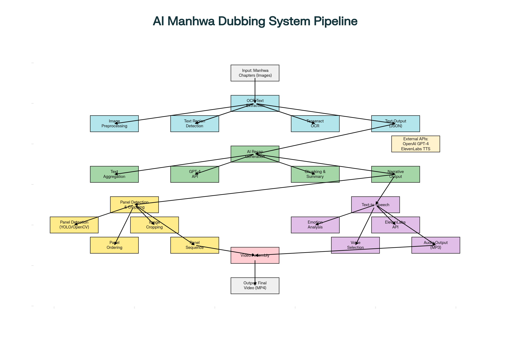

# AI Manhwa Dubbing System for YouTube

[](https://www.python.org/)
[](https://www.python.org/)

> An automated AI-powered pipeline for creating professional manhwa recap videos with emotional voice-over narration and background music for YouTube content creation.

---

This README.md file was generated with Perplexity Pro and Research mode, Best Model:
https://www.perplexity.ai/search/write-a-readme-and-docs-specif-wmW0601GTjCJfr6fpGftug?preview=1#0

/docs:
- README.md
- ARCHITECTURE.md
- COMPONENTS-SPEC.md

---



## 🎯 Project Overview

This AI engineering project automates the entire process of creating manhwa recap videos by extracting text from manhwa chapters, generating intelligent summaries, cropping panels for video sequences, synthesizing emotional voice narration, and assembling everything into a polished 2-3 hour YouTube video.

**Example Reference:** [Manhwa Recap Video Example](https://youtu.be/3Wjqr9wL7B0)

### Key Features

- 🖼️ **Automated OCR Text Extraction** - Extracts all text and dialogues from manhwa panel images using Tesseract OCR
- 🤖 **AI-Powered Recap Generation** - Creates coherent narrative summaries using GPT-4 or similar LLMs
- ✂️ **Intelligent Panel Cropping** - Automatically detects and crops manhwa panels for video sequences
- 🎙️ **Emotional Text-to-Speech** - Generates human-like voice narration with emotional expression (male/female voices)
- 🎬 **Video Assembly Pipeline** - Combines panels, narration, and background music into final video
- 🎵 **Background Soundtrack Integration** - Adds appropriate background music to enhance viewing experience

## 📊 System Architecture

```
Input: Manhwa Chapters (30 chapters)
    ↓
[OCR Module] → Extract Text + Dialogues
    ↓
[AI Recap Engine] → Generate Story Summary
    ↓
[Panel Detection & Cropping] → Extract Visual Sequences
    ↓
[Text-to-Speech Engine] → Generate Voice Narration
    ↓
[Video Assembly Module] → Combine All Components
    ↓
Output: 2-3 Hour Dubbed Recap Video → YouTube Upload
```

## 🛠️ Technology Stack

### Core Technologies
- **Python 3.9+** - Primary programming language
- **Tesseract OCR** - Optical Character Recognition for text extraction
- **OpenCV** - Image processing and panel detection
- **MoviePy/FFmpeg** - Video editing and assembly
- **GPT-4 API** (OpenAI) - AI-powered text summarization
- **ElevenLabs API** - Emotional text-to-speech synthesis
- **NumPy & PIL** - Image manipulation

### AI/ML Components
- Deep learning-based panel detection (YOLO/U-Net)
- Natural Language Processing for summarization
- Voice synthesis with emotional modeling
- Image segmentation for panel extraction

## 📋 Prerequisites

```bash
# Python version
Python >= 3.9

# System dependencies
- Tesseract OCR (4.x+)
- FFmpeg (4.x+)
- ImageMagick (optional)

# API Keys Required
- OpenAI API Key (GPT-4)
- ElevenLabs API Key (TTS)
- (Optional) Background music API
```

## 🚀 Installation

### 1. Clone the Repository

```bash
git clone https://github.com/yourusername/manhwa-dubbing-ai.git
cd manhwa-dubbing-ai
```

### 2. Create Virtual Environment

```bash
python -m venv venv
source venv/bin/activate  # On Windows: venv\Scripts\activate
```

### 3. Install Dependencies

```bash
pip install -r requirements.txt
```

### 4. Install System Dependencies

#### Ubuntu/Debian:
```bash
sudo apt-get update
sudo apt-get install tesseract-ocr ffmpeg
```

#### macOS:
```bash
brew install tesseract ffmpeg
```

#### Windows:
Download and install:
- [Tesseract OCR](https://github.com/UB-Mannheim/tesseract/wiki)
- [FFmpeg](https://ffmpeg.org/download.html)

### 5. Configure API Keys

Create a `.env` file in the project root:

```env
OPENAI_API_KEY=your_openai_api_key_here
ELEVENLABS_API_KEY=your_elevenlabs_api_key_here
BACKGROUND_MUSIC_API_KEY=optional_music_api_key
```

## 📁 Project Structure

```
manhwa-dubbing-ai/
├── src/
│   ├── ocr/
│   │   ├── text_extractor.py       # OCR text extraction
│   │   └── preprocessor.py         # Image preprocessing
│   ├── recap/
│   │   ├── summarizer.py           # AI recap generation
│   │   └── prompt_templates.py     # GPT prompt engineering
│   ├── video/
│   │   ├── panel_detector.py       # Panel detection & cropping
│   │   ├── video_editor.py         # Video assembly
│   │   └── effects.py              # Video effects & transitions
│   ├── tts/
│   │   ├── voice_generator.py      # Text-to-speech engine
│   │   └── emotion_processor.py    # Emotional voice control
│   ├── audio/
│   │   ├── background_music.py     # Music integration
│   │   └── audio_sync.py           # Audio-video synchronization
│   └── pipeline/
│       ├── main_pipeline.py        # Main orchestration
│       └── youtube_uploader.py     # YouTube API integration
├── data/
│   ├── input/                      # Input manhwa chapters
│   ├── output/                     # Generated videos
│   └── temp/                       # Temporary processing files
├── models/
│   └── panel_detection/            # Pre-trained models
├── config/
│   └── config.yaml                 # Configuration settings
├── tests/
│   └── test_*.py                   # Unit tests
├── docs/
│   ├── ARCHITECTURE.md             # Detailed architecture
│   ├── API_REFERENCE.md            # API documentation
│   └── DEPLOYMENT.md               # Deployment guide
├── requirements.txt
├── .env.example
├── README.md
└── LICENSE
```

## 🎯 Usage

### Basic Usage

```python
from src.pipeline.main_pipeline import ManhwaDubbingPipeline

# Initialize pipeline
pipeline = ManhwaDubbingPipeline(
    input_dir="data/input/manhwa_chapters",
    output_dir="data/output"
)

# Run complete pipeline
pipeline.run(
    chapters_range=(1, 30),
    voice_type="female",  # or "male"
    voice_emotion="expressive",
    target_duration=7200  # 2 hours in seconds
)
```

### Step-by-Step Execution

```python
# 1. Extract text from manhwa images
texts = pipeline.extract_text("data/input/chapter_01")

# 2. Generate AI recap
recap = pipeline.generate_recap(texts, max_length=5000)

# 3. Detect and crop panels
panels = pipeline.detect_panels("data/input/chapter_01")

# 4. Generate voice narration
audio = pipeline.generate_voice(recap, voice="female_expressive")

# 5. Assemble final video
video = pipeline.assemble_video(panels, audio, background_music=True)

# 6. Export
video.export("output/manhwa_recap.mp4")
```

### Command Line Interface

```bash
# Process entire manhwa series
python src/pipeline/main_pipeline.py \
    --input data/input/my_manhwa \
    --chapters 1-30 \
    --voice female \
    --emotion dramatic \
    --duration 7200 \
    --output data/output/recap.mp4

# Process with custom configuration
python src/pipeline/main_pipeline.py --config config/custom_config.yaml
```

## 📖 Component Documentation

### 1. OCR Module (Text Extraction)

**Location:** `src/ocr/text_extractor.py`

Extracts text from manhwa panels using Tesseract OCR with preprocessing for improved accuracy.

```python
from src.ocr.text_extractor import ManhwaTextExtractor

extractor = ManhwaTextExtractor(language='eng')
texts = extractor.extract_from_image("chapter1_page1.jpg")
```

**Features:**
- Adaptive thresholding for text clarity
- Speech bubble detection and extraction
- Multi-language support
- Text region localization

### 2. AI Recap Engine

**Location:** `src/recap/summarizer.py`

Generates coherent narrative summaries using GPT-4 API with custom prompt engineering.

```python
from src.recap.summarizer import ManhwaRecapGenerator

generator = ManhwaRecapGenerator(model="gpt-4")
recap = generator.create_recap(
    texts=extracted_texts,
    style="engaging",
    max_length=5000
)
```

**Summarization Methods:**
- **Extractive:** Selects key sentences
- **Abstractive:** Generates new narrative text
- **Hybrid:** Combines both approaches

### 3. Panel Detection & Cropping

**Location:** `src/video/panel_detector.py`

Uses computer vision and deep learning to detect and extract individual panels.

```python
from src.video.panel_detector import PanelDetector

detector = PanelDetector(model='yolov8')
panels = detector.detect_panels("manhwa_page.jpg")
cropped_images = detector.crop_panels(panels)
```

**Technologies:**
- OpenCV contour detection
- YOLOv8 object detection
- U-Net segmentation
- Mathematical morphology

### 4. Text-to-Speech Engine

**Location:** `src/tts/voice_generator.py`

Generates emotional, human-like voice narration using ElevenLabs API.

```python
from src.tts.voice_generator import EmotionalTTS

tts = EmotionalTTS(api_key=ELEVENLABS_KEY)
audio = tts.generate(
    text=recap_text,
    voice="Rachel",  # Female voice
    emotion="dramatic",
    stability=0.75
)
```

**Voice Options:**
- Male/Female voices
- Emotional expressions (happy, sad, angry, dramatic)
- Adjustable speaking rate
- Natural prosody and inflection

### 5. Video Assembly

**Location:** `src/video/video_editor.py`

Combines panels, audio narration, and background music into final video.

```python
from src.video.video_editor import VideoAssembler

assembler = VideoAssembler()
video = assembler.create_video(
    panels=cropped_panels,
    audio=narration_audio,
    background_music="epic_soundtrack.mp3",
    fps=24,
    transitions="fade"
)
```

**Features:**
- Ken Burns effect (zoom/pan)
- Smooth transitions
- Audio-video synchronization
- Background music mixing
- Subtitle overlay (optional)

## ⚙️ Configuration

Edit `config/config.yaml` to customize pipeline settings:

```yaml
ocr:
  engine: tesseract
  language: eng
  preprocessing: true
  
recap:
  model: gpt-4
  max_tokens: 8000
  temperature: 0.7
  style: engaging
  
video:
  fps: 24
  resolution: 1920x1080
  format: mp4
  codec: h264
  panel_duration: 3  # seconds per panel
  
tts:
  provider: elevenlabs
  voice_id: Rachel
  emotion: expressive
  stability: 0.75
  
audio:
  background_music: true
  music_volume: 0.3
  voice_volume: 1.0
```

## 🎨 Advanced Features

### Custom Voice Training

Train custom voices using ElevenLabs Voice Lab:

```python
from src.tts.custom_voice import VoiceTrainer

trainer = VoiceTrainer()
custom_voice = trainer.train_voice(
    samples=["voice_sample1.mp3", "voice_sample2.mp3"],
    name="CustomNarrator"
)
```

### Emotion Detection & Mapping

Automatically detect emotions in text and map to appropriate voice expressions:

```python
from src.tts.emotion_processor import EmotionMapper

mapper = EmotionMapper()
emotional_segments = mapper.analyze_text(recap_text)
audio = tts.generate_with_emotions(emotional_segments)
```

### Batch Processing

Process multiple manhwa series in parallel:

```bash
python src/pipeline/batch_processor.py \
    --input-dir data/manhwa_collection \
    --workers 4 \
    --config config/batch_config.yaml
```

## 📊 Performance Metrics

### Processing Times (Approximate)

| Step | Time per Chapter | Notes |
|------|------------------|-------|
| OCR Extraction | 30-60 seconds | Depends on image quality |
| AI Recap Generation | 20-40 seconds | GPT-4 API latency |
| Panel Detection | 10-20 seconds | GPU accelerated |
| TTS Generation | 2-5 min per 1000 words | ElevenLabs API |
| Video Assembly | 3-5 minutes | FFmpeg encoding |

**Total Pipeline:** ~30-40 minutes for 30 chapters → 2-3 hour video

### Resource Requirements

- **CPU:** 4+ cores recommended
- **RAM:** 8GB minimum, 16GB recommended
- **GPU:** Optional but recommended for panel detection
- **Storage:** 10GB+ for temporary files
- **Network:** Stable internet for API calls

## 🔒 Copyright & Fair Use

**Important Legal Considerations:**

This tool is designed for **educational and transformative content creation**. Users must ensure compliance with copyright laws:

- ✅ **Fair Use:** Commentary, criticism, educational content with proper attribution
- ✅ **Transformative Work:** Significant value-added content (analysis, recap, commentary)
- ❌ **Avoid:** Reproducing entire chapters without transformation
- ⚠️ **Monetization:** May require additional licensing considerations

**Recommendations:**
1. Use only portions necessary for recap/commentary
2. Add substantial original commentary and analysis
3. Credit original creators prominently
4. Consider obtaining permissions for commercial use
5. Monitor YouTube copyright claims and respond appropriately

## 🧪 Testing

Run unit tests:

```bash
# All tests
pytest tests/

# Specific module
pytest tests/test_ocr.py

# With coverage
pytest --cov=src tests/
```

## 🚀 Deployment

### Docker Deployment

```bash
# Build image
docker build -t manhwa-dubbing:latest .

# Run container
docker run -v $(pwd)/data:/app/data \
    -e OPENAI_API_KEY=$OPENAI_API_KEY \
    -e ELEVENLABS_API_KEY=$ELEVENLABS_API_KEY \
    manhwa-dubbing:latest
```

### GitHub Actions (CI/CD)

Automated processing workflow is available in `.github/workflows/process_video.yml`

## 🙏 Acknowledgments

- [Tesseract OCR](https://github.com/tesseract-ocr/tesseract) - OCR engine
- [OpenAI GPT-4](https://openai.com/) - AI summarization
- [ElevenLabs](https://elevenlabs.io/) - Text-to-speech
- [MoviePy](https://zulko.github.io/moviepy/) - Video editing
- [OpenCV](https://opencv.org/) - Computer vision

## 🗺️ Roadmap

- [ ] Multi-language support (Korean, Japanese, Chinese OCR)
- [ ] Real-time processing optimization
- [ ] Web UI for easier interaction
- [ ] YouTube automatic upload integration
- [ ] Character voice consistency tracking
- [ ] Advanced emotion mapping
- [ ] Custom model training pipeline
- [ ] Mobile app support
